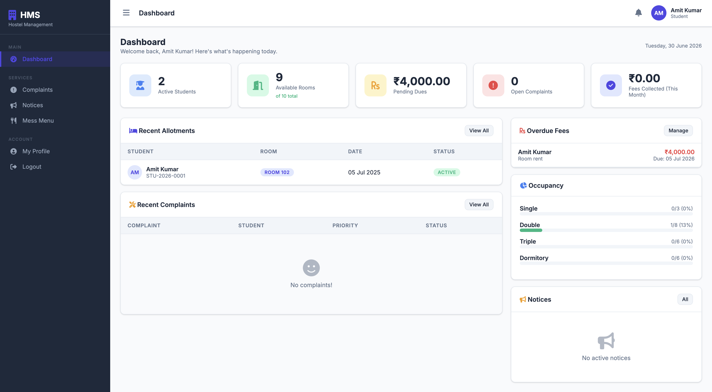
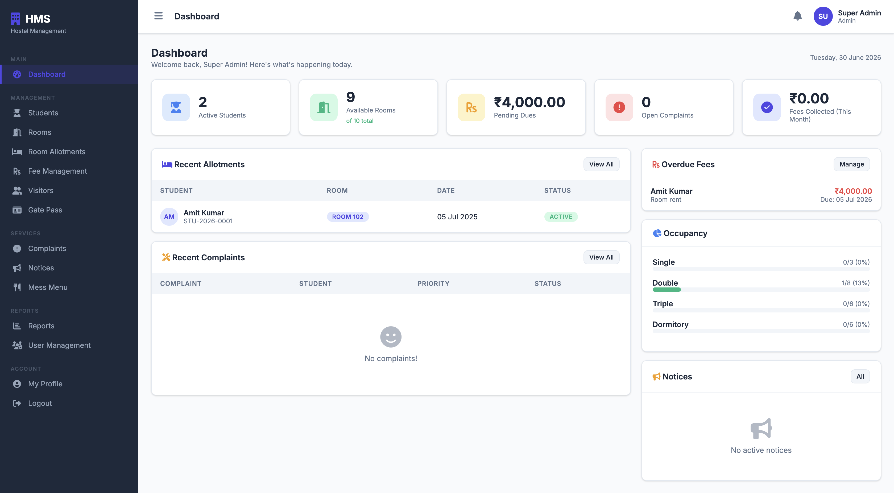
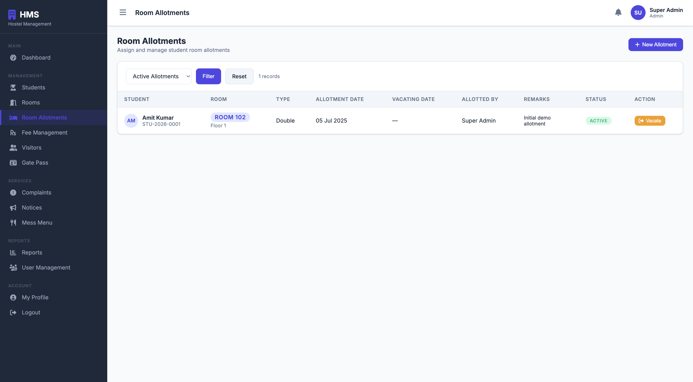
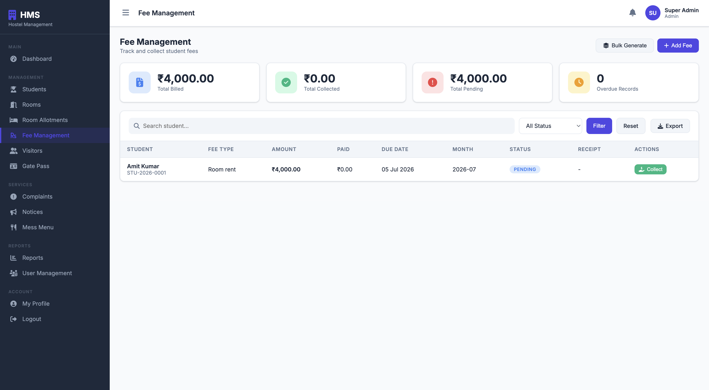
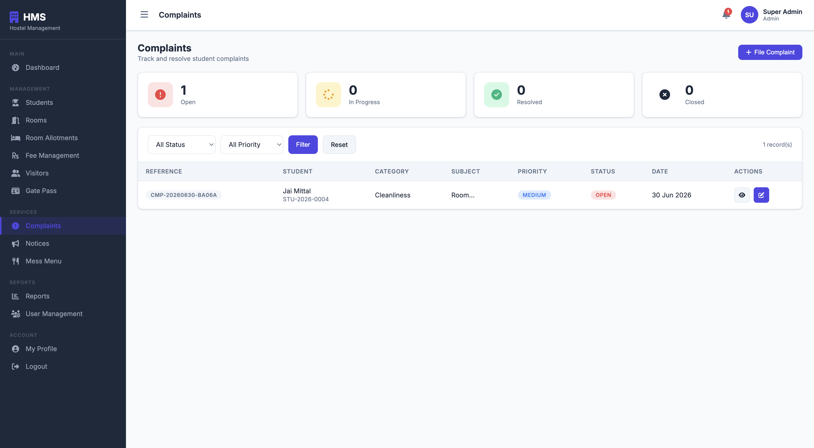
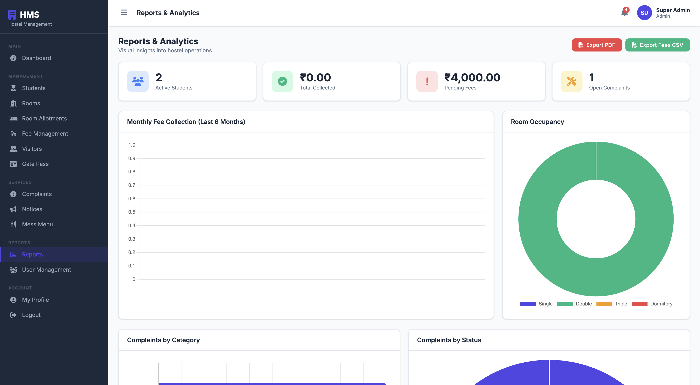

# 🏠 Hostel Management System

A full-stack web application developed using PHP and MySQL to automate hostel administration.

## Features

| Feature | Status |
|----------|--------|
| Student Management | ✅ |
| Room Allocation | ✅ |
| Fee Management | ✅ |
| Complaints | ✅ |
| Visitors | ✅ |
| Gate Pass | ✅ |
| Notices | ✅ |
| Reports | ✅ |
| Authentication | ✅ |

## Technologies

- PHP
- MySQL
- HTML
- CSS
- JavaScript

## 📂 Project Structure

```text
Hostel-Management-System
│
├── css/
├── database/
│   └── hostel_management.sql
├── includes/
│   ├── config.php
│   ├── header.php
│   └── footer.php
├── js/
│   └── main.js
├── php/
│   ├── students.php
│   ├── rooms.php
│   ├── fees.php
│   ├── complaints.php
│   ├── visitors.php
│   ├── notices.php
│   ├── reports.php
│   ├── users.php
│   └── profile.php
├── uploads/
├── dashboard.php
├── index.php
├── login.php
├── logout.php
├── unauthorized.php
├── README.md
└── .gitignore
```

## Installation

1. Clone this repository.
2. Import `hostel_management.sql` into MySQL.
3. Place the project inside XAMPP `htdocs`.
4. Start Apache and MySQL.
5. Open:

http://localhost/Hostel-Management-System

## Author

Jai Mittal

## 📸 Screenshots

### Login Page


---

### Dashboard



---

### Student Management



---

### Room Management



---

### Fee Management



---

### Complaint Management



---

### Reports


